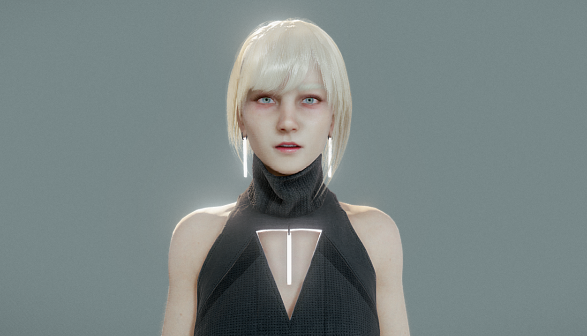

# VRSecretary

<div align="center">

🤖 **AI-Powered VR Secretary** – Production-ready reference implementation combining **Unreal Engine 5 VR**, **local/cloud LLMs**, and **high-quality TTS** for fully interactive virtual assistants in VR.

[](https://opensource.org/licenses/Apache-2.0)
[](https://www.unrealengine.com/)
[](https://www.python.org/)
[](CONTRIBUTING.md)
[](https://github.com/psf/black)

[Features](#-key-features) • [Quick Start](#-quick-start-guide) • [Documentation](#-documentation) • [Architecture](#-architecture-overview) • [Contributing](#-contributing)

</div>

---



---

## 📑 Table of Contents

- [What Is VRSecretary?](#-what-is-vrsecretary)
- [Key Features](#-key-features)
- [System Requirements](#-system-requirements)
- [Quick Start Guide](#-quick-start-guide)
- [Repository Structure](#-repository-structure)
- [Backend Configuration](#%EF%B8%8F-backend-configuration)
- [Unreal Plugin Setup](#-unreal-plugin-setup)
- [AI Persona: Ailey](#-ai-persona-ailey)
- [Avatar Assets](#-avatar-assets)
- [Development & Testing](#%EF%B8%8F-development--testing)
- [Architecture Overview](#-architecture-overview)
- [Troubleshooting](#-troubleshooting)
- [Documentation](#-documentation)
- [Contributing](#-contributing)
- [License](#-license)
- [Acknowledgments](#-acknowledgments)

---

## ✨ What Is VRSecretary?

VRSecretary is a **production-ready, open-source reference architecture** for building AI-powered conversational characters in VR. It combines cutting-edge language models with spatial audio and immersive interaction to create a natural, engaging virtual assistant experience.

### Core Technologies

- **Frontend:** Unreal Engine 5 (VR-native, supports Meta Quest, PCVR, and more)
- **Backend:** Python FastAPI (modular, extensible, engine-agnostic)
- **LLM:** Flexible backend support:
  - **Local:** [Ollama](https://ollama.ai/) (llama3, Mistral, Granite, etc.)
  - **Cloud:** [IBM watsonx.ai](https://www.ibm.com/watsonx)
  - **In-Engine:** llama.cpp via Llama-Unreal plugin
- **TTS:** [Chatterbox](https://github.com/rsxdalv/chatterbox) (natural-sounding, sentence-aware streaming)

### What's Included

✅ Complete **Unreal Engine 5 VR project** with sample secretary character  
✅ **Production-ready plugin** (`VRSecretary`) with Blueprint support  
✅ **FastAPI gateway backend** with clean REST API  
✅ **Sample 3D avatar** (Scifi Girl v.01 - non-commercial demo)  
✅ **Comprehensive documentation** and integration guides  
✅ **Multiple backend modes** (Gateway, Direct Ollama, Local Llama.cpp)  
✅ **Docker support** for easy deployment  
✅ **Load testing tools** and performance benchmarks  

---

## 🌟 Key Features

### 🥽 VR-Native Experience

- **Full 6DOF interaction** with VR controllers
- **3D spatial audio** that follows the character
- **Real-time subtitles** floating above the avatar
- **Teleportation and smooth locomotion** support
- **Hand presence** and gesture recognition ready

### 🧠 Flexible AI Backends

| Mode | Description | Use Case |
|------|-------------|----------|
| **Gateway (Ollama)** | FastAPI → Ollama → TTS → UE | Local development, full features |
| **Gateway (watsonx)** | FastAPI → watsonx.ai → TTS → UE | Cloud deployment, enterprise |
| **Direct Ollama** | UE → OpenAI-style API → UE | Text-only, simple integration |
| **Local Llama.cpp** | UE → in-engine llama.cpp → UE | Offline, embedded deployment |

### 🎙️ High-Quality Voice Synthesis

- **Sentence-aware streaming** for natural pacing
- **Configurable voice parameters** (temperature, speed, exaggeration)
- **Multiple voice profiles** (female/male, extensible)
- **CUDA/MPS acceleration** for real-time generation
- **EOS-safe chunking** prevents audio artifacts

### 🔧 Production-Ready Architecture

- **Engine-agnostic REST API** (Unity, Godot, Web can use same backend)
- **Session management** with conversation history
- **Comprehensive error handling** and logging
- **Configurable via environment variables** and Project Settings
- **Dockerized deployment** with compose files
- **Load testing scripts** included

### 📦 Modular & Extensible

- **Clean separation of concerns** (backend, plugin, assets)
- **Blueprint-friendly components** for rapid prototyping
- **C++ API** for advanced customization
- **Plugin system** for adding new LLM/TTS providers
- **Multiple language support** ready

---

## 💻 System Requirements

### Minimum Requirements

| Component | Specification |
|-----------|---------------|
| **OS** | Windows 10/11 (recommended), Linux/macOS (backend only) |
| **CPU** | Quad-core Intel/AMD, 2.5 GHz+ |
| **RAM** | 16 GB |
| **GPU** | NVIDIA GTX 1060 or equivalent (for VR) |
| **Storage** | 30 GB free space (SSD recommended) |
| **VR Headset** | Meta Quest 2/3, Valve Index, or compatible PCVR |

### Recommended Requirements

| Component | Specification |
|-----------|---------------|
| **CPU** | 8-core Intel i7/AMD Ryzen 7, 3.5 GHz+ |
| **RAM** | 32 GB |
| **GPU** | NVIDIA RTX 3060 or better (CUDA for LLM/TTS acceleration) |
| **Storage** | 50 GB free space on NVMe SSD |

### Software Dependencies

**Required:**
- **Unreal Engine** 5.3 or later (with C++ source access)
- **Visual Studio 2022** (Windows) with "Game development with C++" workload
- **Python** 3.10 or later
- **Git** (for cloning repository)

**Optional:**
- **Docker Desktop** (for containerized backend)
- **Node.js & k6** (for load testing)
- **CUDA Toolkit** 11.8+ (for GPU acceleration)

---

## 🚀 Quick Start Guide

Get from zero to working VR secretary in ~30 minutes.

### Step 1: Clone Repository

```bash
git clone https://github.com/ruslanmv/VRSecretary.git
cd VRSecretary
```

### Step 2: Start Backend Services

#### 2.1 Install Ollama

Download and install from [https://ollama.ai/](https://ollama.ai/)

```bash
# Start Ollama server
ollama serve

# In a new terminal, download a model
ollama pull llama3
```

Verify:
```bash
curl http://localhost:11434/v1/models
```

#### 2.2 Setup Python Environment

```bash
cd backend/gateway

# Create virtual environment
python -m venv .venv

# Activate (Windows PowerShell)
.venv\Scripts\Activate.ps1

# Activate (Linux/macOS)
# source .venv/bin/activate

# Install dependencies
pip install -e .
```

#### 2.3 Configure Environment

```bash
# Copy template
cp ../docker/env.example .env

# Edit .env with your preferred editor
```

**Minimal `.env` configuration:**
```env
MODE=offline_local_ollama

OLLAMA_BASE_URL=http://localhost:11434
OLLAMA_MODEL=llama3
OLLAMA_TIMEOUT=60.0

CHATTERBOX_URL=http://localhost:4123
CHATTERBOX_TIMEOUT=30.0

SESSION_MAX_HISTORY=10
```

#### 2.4 Start Gateway Server

```bash
uvicorn vrsecretary_gateway.main:app --reload --host 0.0.0.0 --port 8000
```

**Verify backend is running:**
- API docs: http://localhost:8000/docs
- Health check: http://localhost:8000/health

### Step 3: Start TTS Server

In a **new terminal** (keep gateway running):

```bash
# From repo root
cd VRSecretary

# Activate same venv
backend/gateway/.venv/Scripts/Activate.ps1  # Windows
# source backend/gateway/.venv/bin/activate  # Linux/macOS

# Start Chatterbox TTS server
python tools/vr_chatterbox_server.py --host 0.0.0.0 --port 4123
```

**Optional environment variables:**
```bash
# Force CUDA (default: auto-detect)
export CHATTERBOX_DEVICE=cuda

# Chunk size for streaming (default: 20 words)
export CHATTERBOX_CHUNK_SIZE=20

# Custom voice files (optional)
export CHATTERBOX_FEMALE_VOICE=/path/to/female_voice.wav
export CHATTERBOX_MALE_VOICE=/path/to/male_voice.wav
```

**Test TTS (PowerShell):**
```powershell
Invoke-WebRequest `
  -Uri "http://localhost:4123/v1/audio/speech" `
  -Method POST `
  -ContentType "application/json" `
  -Body '{"input": "Hello from Ailey.", "voice": "female"}' `
  -OutFile "test.wav"
```

**Test TTS (curl):**
```bash
curl -X POST http://localhost:4123/v1/audio/speech \
  -H "Content-Type: application/json" \
  -d '{"input": "Hello from Ailey.", "voice": "female"}' \
  --output test.wav
```

Play `test.wav` to verify audio quality.

### Step 4: Verify End-to-End

With all three services running (Ollama, Gateway, TTS):

```bash
curl -X POST http://localhost:8000/api/vr_chat \
  -H "Content-Type: application/json" \
  -d '{"session_id": "test-123", "user_text": "Hello Ailey, introduce yourself."}'
```

**Expected response:**
```json
{
  "assistant_text": "Hi! I'm Ailey, your VR secretary. I'm here to help...",
  "audio_wav_base64": "UklGRiQAAABXQVZF..."
}
```

✅ If you see text and base64 audio, the backend is working!

### Step 5: Open Unreal Project

#### 5.1 Generate Project Files

Navigate to:
```
VRSecretary/samples/unreal-vr-secretary-demo/
```

**Right-click** `VRSecretaryDemo.uproject` → **Generate Visual Studio project files**

#### 5.2 Open in Unreal

Double-click `VRSecretaryDemo.uproject`

Unreal will:
1. Compile C++ modules (including VRSecretary plugin)
2. Load the project (first time may take 5-10 minutes)

#### 5.3 Enable Plugin

1. **Edit → Plugins**
2. Search: **`VRSecretary`**
3. ✅ Check **Enabled** (should already be checked)
4. Restart editor if prompted

#### 5.4 Configure Plugin Settings

1. **Edit → Project Settings**
2. Navigate to: **Plugins → VRSecretary**
3. Set:
   - **Gateway URL**: `http://localhost:8000`
   - **Backend Mode**: `Gateway (Ollama)`
   - **HTTP Timeout**: `60.0`
   - **Language Code**: (leave empty for English)

### Step 6: Import Avatar

#### 6.1 Locate Avatar File

```
VRSecretary/assets/avatars/scifi_girl_v01/scifi_girl_v.01.glb
```

#### 6.2 Import to Unreal

1. In **Content Browser**, navigate to: `/Game/Characters/ScifiGirl/`
2. **Right-click** → **Import to /Game/Characters/ScifiGirl/**
3. Select `scifi_girl_v.01.glb`
4. **Import Settings**:
   - ✅ Import Mesh
   - ✅ Import Skeletal Mesh
   - ✅ Import Materials
   - ✅ Import Textures
5. Click **Import All**

#### 6.3 Setup Blueprint

Open `BP_SecretaryAvatar`:
1. **Components** panel → Select **Mesh** component
2. **Details** panel → **Mesh** → Select imported skeletal mesh
3. Adjust **Transform** if needed (scale, rotation)
4. **Compile** and **Save**

### Step 7: Test in VR

#### 7.1 Connect VR Headset

- **Meta Quest:** Enable developer mode, connect via Link/Air Link
- **PCVR:** Connect via SteamVR or native runtime

#### 7.2 Launch VR Preview

1. Click **Play** dropdown (top toolbar)
2. Select **VR Preview**
3. Put on headset

#### 7.3 Interact with Ailey

**Desktop Mode (testing without VR):**
- Press **T** key → Opens chat interface
- Type message → Press **Enter**
- See subtitle above character
- Hear audio response

**VR Mode:**
- Press **Right Trigger** → Opens 3D chat panel
- Point laser at text field → Click trigger to focus
- Use VR keyboard or voice input (if configured)
- Press trigger on **Send** button

**Expected behavior:**
1. Your message appears in chat
2. Subtitle appears above Ailey's head
3. Audio plays from character position (3D spatial)
4. Response text appears in chat history

---

## 🗂️ Repository Structure

```
VRSecretary/
├── 📁 assets/
│   └── 📁 avatars/
│       └── 📁 scifi_girl_v01/
│           ├── scifi_girl_v.01.glb          # Sample avatar (CC BY-NC-SA)
│           ├── README.md                    # License & attribution
│           └── DOWNLOAD_INSTRUCTIONS.txt
│
├── 📁 backend/
│   ├── 📁 gateway/                          # FastAPI backend
│   │   ├── pyproject.toml                   # Python dependencies
│   │   ├── README.md                        # Backend docs
│   │   └── 📁 vrsecretary_gateway/
│   │       ├── main.py                      # FastAPI app entrypoint
│   │       ├── config.py                    # Settings (Pydantic)
│   │       ├── 📁 api/                      # REST endpoints
│   │       │   ├── health_router.py
│   │       │   └── vr_chat_router.py
│   │       ├── 📁 llm/                      # LLM clients
│   │       │   ├── base_client.py
│   │       │   ├── ollama_client.py
│   │       │   └── watsonx_client.py
│   │       ├── 📁 tts/                      # TTS integration
│   │       │   └── chatterbox_client.py
│   │       └── 📁 models/                   # Request/response schemas
│   │           ├── chat_models.py
│   │           └── session_store.py
│   └── 📁 docker/
│       ├── Dockerfile.gateway
│       ├── docker-compose.dev.yml
│       └── env.example
│
├── 📁 engine-plugins/
│   └── 📁 unreal/
│       └── 📁 VRSecretary/                  # Main Unreal plugin
│           ├── VRSecretary.uplugin
│           ├── README.md                    # Plugin documentation
│           ├── 📁 Source/VRSecretary/
│           │   ├── VRSecretary.Build.cs
│           │   ├── 📁 Public/
│           │   │   ├── VRSecretaryComponent.h       # Main component
│           │   │   ├── VRSecretarySettings.h        # Project settings
│           │   │   ├── VRSecretaryChatTypes.h       # Enums, structs
│           │   │   └── VRSecretaryLog.h
│           │   └── 📁 Private/
│           │       ├── VRSecretaryModule.cpp
│           │       ├── VRSecretaryComponent.cpp
│           │       ├── VRSecretarySettings.cpp
│           │       └── VRSecretaryLog.cpp
│           └── 📁 ThirdParty/
│               └── 📁 LlamaCpp/                     # Optional llama.cpp
│
├── 📁 samples/
│   ├── 📁 unreal-vr-secretary-demo/        # Example UE5 project
│   │   ├── VRSecretaryDemo.uproject
│   │   ├── 📁 Config/
│   │   │   └── DefaultEngine.ini
│   │   └── 📁 Content/
│   │       ├── 📁 Blueprints/               # BP_VRPawn, BP_DesktopPlayer
│   │       ├── 📁 UI/                       # WBP_ChatInterface
│   │       ├── 📁 Characters/               # BP_SecretaryAvatar
│   │       └── 📁 Maps/                     # VRSecretaryLevel
│   └── 📁 backend-notebooks/
│       └── prototype-calls.ipynb
│
├── 📁 docs/
│   ├── overview.md
│   ├── architecture.md
│   ├── unreal-integration.md                # Step-by-step UE setup
│   ├── engine-agnostic-api.md               # REST API reference
│   ├── persona-ailey.md                     # Customizing AI behavior
│   └── troubleshooting.md
│
├── 📁 tools/
│   ├── 📁 scripts/
│   │   ├── start_local_stack.sh
│   │   └── generate_openapi_client.sh
│   ├── 📁 perf/
│   │   ├── load_test_vr_chat.k6.js         # k6 load tests
│   │   └── profiling_notes.md
│   └── vr_chatterbox_server.py              # Optimized TTS server
│
├── 📁 .github/
│   ├── 📁 workflows/                        # CI/CD
│   │   ├── backend-tests.yml
│   │   └── unreal-build.yml
│   └── 📁 ISSUE_TEMPLATE/
│
├── LICENSE                                  # Apache 2.0
├── CODE_OF_CONDUCT.md
├── CONTRIBUTING.md
└── README.md                                # This file
```

---

## ⚙️ Backend Configuration

### Environment Variables (`.env`)

Located at: `backend/gateway/.env`

#### Core Settings

```env
# ===========================================
# CORE MODE
# ===========================================
# Options: offline_local_ollama | online_watsonx
MODE=offline_local_ollama

# ===========================================
# OLLAMA (Local LLM)
# ===========================================
OLLAMA_BASE_URL=http://localhost:11434
OLLAMA_MODEL=llama3
OLLAMA_TIMEOUT=60.0
OLLAMA_TEMPERATURE=0.7
OLLAMA_MAX_TOKENS=256

# ===========================================
# CHATTERBOX (TTS)
# ===========================================
CHATTERBOX_URL=http://localhost:4123
CHATTERBOX_TIMEOUT=30.0

# ===========================================
# WATSONX.AI (Cloud LLM - Optional)
# ===========================================
# Uncomment if MODE=online_watsonx
# WATSONX_URL=https://us-south.ml.cloud.ibm.com
# WATSONX_PROJECT_ID=your-project-id-here
# WATSONX_MODEL_ID=ibm/granite-13b-chat-v2
# WATSONX_API_KEY=your-api-key-here
# WATSONX_TIMEOUT=60.0
# WATSONX_TEMPERATURE=0.7
# WATSONX_MAX_TOKENS=256

# ===========================================
# SESSION MANAGEMENT
# ===========================================
SESSION_MAX_HISTORY=10                      # Max conversation turns to remember

# ===========================================
# LOGGING
# ===========================================
LOG_LEVEL=INFO                              # DEBUG | INFO | WARNING | ERROR
```

### Backend Modes Explained

#### Mode 1: Gateway (Ollama) - **Recommended for Development**

**Flow:** UE5 → FastAPI → Ollama → TTS → UE5

**Pros:**
- ✅ Full features (text + audio)
- ✅ Easy to debug
- ✅ Session history management
- ✅ Flexible persona configuration

**Cons:**
- ❌ Requires running 3 services
- ❌ Not suitable for embedded deployment

**Setup:**
```env
MODE=offline_local_ollama
OLLAMA_BASE_URL=http://localhost:11434
OLLAMA_MODEL=llama3
CHATTERBOX_URL=http://localhost:4123
```

#### Mode 2: Gateway (watsonx.ai) - **Enterprise/Cloud**

**Flow:** UE5 → FastAPI → watsonx.ai → TTS → UE5

**Pros:**
- ✅ Cloud-based (no local GPU needed)
- ✅ Enterprise-grade models
- ✅ Full features (text + audio)
- ✅ Scalable

**Cons:**
- ❌ Requires API key & internet
- ❌ Usage costs
- ❌ Latency depends on connection

**Setup:**
```env
MODE=online_watsonx
WATSONX_URL=https://us-south.ml.cloud.ibm.com
WATSONX_PROJECT_ID=your-project-id
WATSONX_MODEL_ID=ibm/granite-13b-chat-v2
WATSONX_API_KEY=your-api-key
CHATTERBOX_URL=http://localhost:4123
```

#### Mode 3: Direct Ollama - **Simplified Integration**

**Flow:** UE5 → Ollama (OpenAI-compatible API) → UE5

**Pros:**
- ✅ Simplest setup (1 service)
- ✅ OpenAI-compatible API
- ✅ No gateway needed

**Cons:**
- ❌ Text only (no audio)
- ❌ No conversation history
- ❌ No persona customization

**UE Settings:**
- Backend Mode: `DirectOllama`
- Direct Ollama URL: `http://localhost:11434`
- Direct Ollama Model: `llama3`

#### Mode 4: Local Llama.cpp - **Fully Offline**

**Flow:** UE5 → In-Engine llama.cpp → UE5

**Pros:**
- ✅ Completely offline
- ✅ No external services
- ✅ Embeddable
- ✅ Low latency

**Cons:**
- ❌ Text only (no audio by default)
- ❌ Requires GGUF model files
- ❌ More complex setup
- ❌ GPU/CPU intensive

**UE Settings:**
- Backend Mode: `LocalLlamaCpp`
- Requires: Llama-Unreal plugin enabled
- Requires: ULlamaComponent on same actor

---

## 🎮 Unreal Plugin Setup

### Plugin Installation

#### Method 1: Use Sample Project (Recommended)

Already included in `samples/unreal-vr-secretary-demo/Plugins/VRSecretary/`

#### Method 2: Add to Your Project

```bash
# From VRSecretary repo root
mkdir -p /path/to/YourProject/Plugins
cp -r engine-plugins/unreal/VRSecretary /path/to/YourProject/Plugins/
```

Then:
1. Right-click `YourProject.uproject` → **Generate Visual Studio project files**
2. Open in Visual Studio
3. Build **Development Editor | Win64**
4. Open project in Unreal

### Project Settings

**Edit → Project Settings → Plugins → VRSecretary**

| Setting | Description | Example |
|---------|-------------|---------|
| **Gateway URL** | FastAPI backend URL | `http://localhost:8000` |
| **HTTP Timeout** | Request timeout (seconds) | `60.0` |
| **Backend Mode** | Which backend to use | `Gateway (Ollama)` |
| **Direct Ollama URL** | For DirectOllama mode | `http://localhost:11434` |
| **Direct Ollama Model** | Model name | `llama3` |
| **Language Code** | ISO 639-1 code (empty = English) | `en` or empty |

### Blueprint Integration

#### 1. Add Component to Actor

In your Player Pawn or VR Manager blueprint:

1. **Components** panel → **+ Add Component**
2. Search: `VRSecretary`
3. Add **VRSecretaryComponent**

#### 2. Bind Events

**Event Graph:**

1. Select **VRSecretaryComponent**
2. **Details → Events**:
   - **+ On Assistant Response** → Fires when AI replies
   - **+ On Error** → Fires on failure

#### 3. Send User Text

Create this logic:

```
[User Input Event]
    ↓
[Make VRSecretaryChatConfig]
    - Temperature: 0.7
    - TopP: 0.9
    - MaxTokens: 256
    ↓
[VRSecretaryComponent → Send User Text]
    - User Text: (from input)
    - Config: (from Make Config)
```

#### 4. Handle Response

**On Assistant Response:**

```
[Event OnAssistantResponse]
    - AssistantText (String)
    - AudioWavBase64 (String)
    ↓
[Update Subtitle Text] ← Display above avatar
    ↓
[Decode Base64 to Sound Wave]
    ↓
[Play Audio at Character Position]
```

**On Error:**

```
[Event OnError]
    - ErrorMessage (String)
    ↓
[Print String] ← Show to user
    - Text: ErrorMessage
    - Color: Red
```

### Advanced: Per-Component Mode Override

On **VRSecretaryComponent**:
- ✅ Check: **Override Backend Mode**
- Set: **Backend Mode Override** to desired mode

This overrides Project Settings for this specific component.

---

## 🧠 AI Persona: Ailey

### Default Personality

Ailey is configured via the system prompt in:
```
backend/gateway/vrsecretary_gateway/api/vr_chat_router.py
```

**Default traits:**
- **Professional yet approachable** - Executive assistant style
- **Concise** - Optimized for spoken responses (60-120 words)
- **Proactive** - Offers suggestions and next steps
- **VR-aware** - References virtual office context
- **Organized** - Good at structuring tasks and planning

### Customizing Ailey

Edit the `SYSTEM_PROMPT` constant:

```python
SYSTEM_PROMPT = """You are Ailey, a highly capable virtual secretary in a VR environment.

Your role:
- Assist the user with tasks, scheduling, and information
- Be professional yet warm and personable
- Keep responses concise (ideal: 2-3 sentences, max 120 words)
- Offer proactive suggestions when appropriate
- Reference the virtual office environment naturally

Tone: Friendly, efficient, and supportive.
"""
```

### Persona Variants

See `docs/persona-ailey.md` for pre-made variants:

| Variant | Use Case | Tone |
|---------|----------|------|
| **Default** | General assistant | Balanced, professional |
| **Formal** | Executive meetings | Corporate, reserved |
| **Casual** | Creative work | Relaxed, friendly |
| **Technical** | Dev/engineering | Precise, detail-oriented |
| **Coach** | Productivity/wellness | Motivational, supportive |
| **Tutor** | Learning/teaching | Patient, explanatory |

### Multi-Language Support

Set in plugin settings:
- **Language Code**: `es` (Spanish), `fr` (French), `de` (German), etc.

Modify system prompt to match:
```python
SYSTEM_PROMPT_ES = """Eres Ailey, una secretaria virtual altamente capaz..."""
```

---

## 🎭 Avatar Assets

### Included Avatar: Scifi Girl v.01

**Location:** `assets/avatars/scifi_girl_v01/scifi_girl_v.01.glb`

**Details:**
- **Author:** patrix
- **Source:** [Sketchfab](https://sketchfab.com/3d-models/scifi-girl-v01-96340701c2ed4d37851c7d9109eee9c0)
- **License:** [CC BY-NC-SA 4.0](https://creativecommons.org/licenses/by-nc-sa/4.0/)
- **Usage:** **Non-commercial only**

### ⚠️ Important License Notes

**You CANNOT use Scifi Girl v.01 in commercial products!**

For commercial use, you must:
1. **Replace** with a commercial-licensed avatar:
   - Unreal Marketplace
   - Sketchfab (commercial license)
   - Custom-commissioned model
   - CC0 / Public Domain assets

2. **Obtain permission** from original creator (patrix)

3. **Remove** the sample avatar entirely

### Using Custom Avatars

#### Requirements

Your avatar should have:
- ✅ Skeletal mesh with humanoid rig
- ✅ Materials/textures
- ✅ LODs (optional but recommended for VR)
- ✅ Compatible with UE5 skeleton

#### Import Process

1. **Import to Unreal:**
   - Drag FBX/GLB into Content Browser
   - Set import options (skeletal mesh, materials, textures)

2. **Setup in BP_SecretaryAvatar:**
   - Open blueprint
   - Select **Mesh** component
   - Change **Skeletal Mesh** to your imported asset

3. **Adjust components:**
   - **VoiceAudio** location (head height)
   - **SubtitleText** location (above head)

4. **Test in editor:**
   - Play → VR Preview
   - Verify positioning and scale

---

## 🛠️ Development & Testing

### Running Tests

#### Backend Unit Tests

```bash
cd backend/gateway
pytest

# With coverage
pytest --cov=vrsecretary_gateway --cov-report=html

# View coverage report
open htmlcov/index.html  # macOS/Linux
start htmlcov/index.html  # Windows
```

#### Load Testing

Requires [k6](https://k6.io/):

```bash
cd tools/perf
k6 run load_test_vr_chat.k6.js

# With custom config
k6 run --vus 10 --duration 30s load_test_vr_chat.k6.js
```

**Metrics to watch:**
- `http_req_duration` (p95 < 2s for good UX)
- `http_req_failed` (should be 0%)
- Concurrent users vs throughput

### Docker Development

#### Build and Run

```bash
cd backend/docker
docker-compose -f docker-compose.dev.yml up --build
```

Services started:
- **Ollama** → `http://localhost:11434`
- **Gateway** → `http://localhost:8000`

**Note:** Chatterbox typically runs on host for GPU access.

#### Stopping

```bash
docker-compose -f docker-compose.dev.yml down
```

### Code Quality

#### Python (Backend)

```bash
# Format code
black backend/gateway/

# Lint
flake8 backend/gateway/

# Type checking
mypy backend/gateway/
```

#### C++ (Unreal Plugin)

Follow Unreal Engine coding standards:
- **Naming:** `PascalCase` for classes, `bCamelCase` for bools
- **Headers:** Minimal includes, forward declarations
- **Blueprint Exposure:** Use `UPROPERTY` and `UFUNCTION` macros

### Debugging

#### Backend Logs

```bash
# Set debug level in .env
LOG_LEVEL=DEBUG

# Run gateway with verbose output
uvicorn vrsecretary_gateway.main:app --log-level debug
```

#### Unreal Logs

**Output Log** (Window → Developer Tools → Output Log):
- Filter: `LogVRSecretary`
- Shows HTTP requests, responses, errors

**Blueprint Debugging:**
- Add **Print String** nodes
- Use **Breakpoints** in Blueprint graph

---

## 🏗️ Architecture Overview

### High-Level Flow

```
┌─────────────┐
│   Player    │
│  (VR/Desktop)│
└──────┬──────┘
       │ Speaks/Types
       ▼
┌─────────────────────────────────────────┐
│  VRSecretaryComponent (C++/Blueprint)   │
│  - Accepts user text                    │
│  - Routes to backend based on mode      │
│  - Fires events with response           │
└──────┬─────────────────────────┬────────┘
       │                         │
       │ Gateway Mode            │ Direct/Local Mode
       ▼                         ▼
┌─────────────┐          ┌──────────────┐
│  FastAPI    │          │   Ollama     │
│  Gateway    │          │   Direct     │
└──────┬──────┘          └──────┬───────┘
       │                        │
       ▼                        │
┌─────────────┐                 │
│   Ollama    │◄────────────────┘
│  or watsonx │
│    (LLM)    │
└──────┬──────┘
       │ Response Text
       ▼
┌─────────────┐
│ Chatterbox  │
│    (TTS)    │
└──────┬──────┘
       │ WAV Audio
       ▼
┌──────────────────────┐
│  VRSecretaryComponent│
│  - Decodes base64    │
│  - Plays sound wave  │
│  - Updates subtitle  │
└──────────────────────┘
```

### Key Components

#### 1. VRSecretaryComponent (C++)

**Responsibilities:**
- Expose Blueprint-friendly API
- HTTP request handling (via FHttpModule)
- Backend mode routing
- Event broadcasting
- Error handling

**Public API:**
```cpp
// Send user input to AI
UFUNCTION(BlueprintCallable)
void SendUserText(const FString& UserText, const FVRSecretaryChatConfig& Config);

// Delegates (events)
UPROPERTY(BlueprintAssignable)
FOnAssistantResponse OnAssistantResponse;

UPROPERTY(BlueprintAssignable)
FOnError OnError;
```

#### 2. FastAPI Gateway

**Endpoints:**
- `GET /health` - Health check
- `POST /api/vr_chat` - Main chat endpoint

**Request Schema:**
```json
{
  "session_id": "string",
  "user_text": "string",
  "language": "string (optional)",
  "temperature": 0.7,
  "top_p": 0.9,
  "max_tokens": 256
}
```

**Response Schema:**
```json
{
  "assistant_text": "string",
  "audio_wav_base64": "string (optional)"
}
```

#### 3. LLM Clients

**Base Interface:**
```python
class BaseLLMClient(ABC):
    @abstractmethod
    async def generate(
        self,
        messages: List[Dict[str, str]],
        temperature: float,
        max_tokens: int
    ) -> str:
        pass
```

**Implementations:**
- `OllamaClient` - Local Ollama
- `WatsonxClient` - IBM watsonx.ai

#### 4. TTS Server

**Endpoints:**
- `POST /v1/audio/speech` - Non-streaming TTS
- `POST /v1/audio/speech/stream` - Streaming TTS

**Features:**
- Sentence-aware chunking
- GPU acceleration
- Configurable voice parameters
- EOS-safe generation

### Data Flow Examples

#### Example 1: Gateway Mode (Full)

1. User presses trigger in VR
2. VR keyboard input → "Schedule a meeting"
3. `VRSecretaryComponent.SendUserText()` called
4. HTTP POST to `http://localhost:8000/api/vr_chat`
5. Gateway assembles conversation history
6. Gateway calls Ollama: "You are Ailey..." + history + user text
7. Ollama responds: "I'd be happy to help schedule that..."
8. Gateway sends response to Chatterbox
9. Chatterbox generates WAV audio
10. Gateway returns: `{ assistant_text, audio_wav_base64 }`
11. Component fires `OnAssistantResponse` event
12. Blueprint logic:
    - Updates subtitle (TextRender component)
    - Decodes base64 to USoundWave
    - Plays audio at character location

#### Example 2: Direct Ollama Mode (Text Only)

1. User types: "Hello"
2. `VRSecretaryComponent.SendUserText()` called
3. HTTP POST to `http://localhost:11434/v1/chat/completions` (OpenAI-style)
4. Ollama responds with text only
5. Component fires `OnAssistantResponse` with empty audio
6. Blueprint displays text only (no audio playback)

---

## 🔧 Troubleshooting

### Common Issues

#### 1. "Failed to connect to backend"

**Symptoms:**
- Red error in Unreal Output Log
- OnError event fires
- No response from AI

**Solutions:**

✅ **Check backend is running:**
```bash
curl http://localhost:8000/health
```

✅ **Check Gateway URL in Project Settings:**
- Should be `http://localhost:8000` (no trailing slash)

✅ **Check firewall:**
- Windows: Allow Python through firewall
- Antivirus: Whitelist backend ports (8000, 11434, 4123)

✅ **Check Output Log:**
- Filter: `LogVRSecretary`
- Look for HTTP error codes (404, 500, etc.)

#### 2. "No audio in response"

**Symptoms:**
- Text response works
- `audio_wav_base64` is null or empty

**Solutions:**

✅ **Verify Chatterbox is running:**
```bash
curl http://localhost:4123/health
```

✅ **Check backend logs:**
- Look for TTS errors
- Verify `CHATTERBOX_URL` in `.env`

✅ **Test TTS directly:**
```bash
curl -X POST http://localhost:4123/v1/audio/speech \
  -H "Content-Type: application/json" \
  -d '{"input": "Test", "voice": "female"}' \
  --output test.wav
```

✅ **Check GPU/CUDA:**
- Chatterbox needs GPU for real-time TTS
- CPU fallback is very slow

#### 3. "Ollama model not found"

**Symptoms:**
- Backend error: "Model llama3 not found"

**Solutions:**

✅ **Download model:**
```bash
ollama pull llama3
```

✅ **List available models:**
```bash
ollama list
```

✅ **Update .env:**
- Set `OLLAMA_MODEL` to exact model name

#### 4. "Compile errors in Unreal"

**Symptoms:**
- "Cannot find VRSecretaryComponent.h"
- Build fails in Visual Studio

**Solutions:**

✅ **Regenerate project files:**
- Right-click `.uproject` → **Generate Visual Studio project files**

✅ **Check plugin is enabled:**
- Edit → Plugins → VRSecretary → ✅ Enabled

✅ **Clean build:**
- Visual Studio: **Build → Clean Solution**
- Then: **Build → Build Solution**

✅ **Verify Unreal version:**
- Project requires UE 5.3 or later

#### 5. "Slow response times"

**Symptoms:**
- 10+ second delay
- Audio takes minutes to generate

**Solutions:**

✅ **Use GPU acceleration:**
- Ollama: Ensure CUDA is installed
- Chatterbox: Set `CHATTERBOX_DEVICE=cuda`

✅ **Use smaller models:**
- `llama3:8b` instead of `llama3:70b`

✅ **Reduce max_tokens:**
- Lower to 128 or 200 for faster responses

✅ **Check system resources:**
- Monitor GPU/CPU usage
- Close other GPU-intensive apps

#### 6. "Avatar not visible in VR"

**Symptoms:**
- Chat works but no character
- Empty space where avatar should be

**Solutions:**

✅ **Check BP_SecretaryAvatar:**
- Mesh component has valid skeletal mesh assigned

✅ **Check transform/scale:**
- Position: visible in VR space
- Scale: 1.0 (or appropriate size)

✅ **Check collision:**
- Collision preset allows visibility

✅ **Check layer:**
- Not hidden by visibility settings

### Performance Optimization

#### Backend

**Slow LLM responses:**
- Use quantized models (Q4, Q5 instead of FP16)
- Enable GPU inference
- Reduce `max_tokens`

**High memory usage:**
- Limit `SESSION_MAX_HISTORY`
- Use smaller context window
- Consider model with smaller params

#### Unreal

**Low FPS in VR:**
- Reduce avatar poly count (use LODs)
- Optimize materials (use simple shaders)
- Disable unnecessary features (dynamic shadows)

**Audio stuttering:**
- Increase audio buffer size
- Pre-cache common responses
- Use audio compression

---

## 📚 Documentation

### Full Documentation

| Document | Description |
|----------|-------------|
| **[Architecture](docs/architecture.md)** | Detailed system design, data flows |
| **[Unreal Integration](docs/unreal-integration.md)** | Step-by-step plugin setup guide |
| **[Engine-Agnostic API](docs/engine-agnostic-api.md)** | REST API reference for any engine |
| **[Persona: Ailey](docs/persona-ailey.md)** | Customizing AI personality |
| **[Troubleshooting](docs/troubleshooting.md)** | Extended problem-solving guide |

### Quick Links

- **Backend README:** `backend/gateway/README.md`
- **Plugin README:** `engine-plugins/unreal/VRSecretary/README.md`
- **Sample Project:** `samples/unreal-vr-secretary-demo/README.md`

---

## 🤝 Contributing

We welcome contributions of all kinds!

### Ways to Contribute

- 🐛 Report bugs via [GitHub Issues](https://github.com/ruslanmv/VRSecretary/issues)
- 💡 Suggest features or improvements
- 📖 Improve documentation
- 🧪 Add tests
- 🎨 Create new avatar assets (with compatible licenses)
- 🔌 Implement new LLM/TTS backends
- 🎮 Create Unity/Godot clients

### Development Workflow

1. **Fork** the repository
2. **Create** a feature branch: `git checkout -b feature/amazing-feature`
3. **Commit** your changes: `git commit -m 'Add amazing feature'`
4. **Push** to branch: `git push origin feature/amazing-feature`
5. **Open** a Pull Request

### Guidelines

- Read [CONTRIBUTING.md](CONTRIBUTING.md) for detailed guidelines
- Follow [CODE_OF_CONDUCT.md](CODE_OF_CONDUCT.md)
- Write tests for new features
- Update documentation
- Keep commits atomic and well-described
- Use [conventional commits](https://www.conventionalcommits.org/)

### Code Style

**Python:**
- Format with [Black](https://github.com/psf/black)
- Lint with [Flake8](https://flake8.pycqa.org/)
- Type hints with [MyPy](https://mypy.readthedocs.io/)

**C++:**
- Follow [Unreal Engine Coding Standard](https://docs.unrealengine.com/5.3/en-US/epic-cplusplus-coding-standard-for-unreal-engine/)
- Use `clang-format` (UE5 style)

**Blueprints:**
- Use clear node naming
- Add comment blocks
- Keep graphs organized (left → right flow)

---

## 📄 License

### Code License

**Apache License 2.0**

- ✅ Commercial use allowed
- ✅ Modification allowed
- ✅ Distribution allowed
- ✅ Patent use allowed
- ⚠️ Requires: Attribution, License notice, State changes
- ⚠️ Does NOT grant: Trademark rights, Liability protection

See [LICENSE](LICENSE) for full text.

### Asset License (Scifi Girl v.01 Avatar)

**Creative Commons Attribution-NonCommercial-ShareAlike 4.0**

- ✅ Non-commercial use only
- ✅ Adaptation allowed (with same license)
- ⚠️ Requires: Attribution to original creator
- ❌ Commercial use prohibited without permission

**Original Creator:** [patrix on Sketchfab](https://sketchfab.com/patrix)

**Important:** Code and assets have **separate licenses**. For commercial projects, you **must** replace non-commercial assets.

---

## 🙏 Acknowledgments

### Technologies

- [Unreal Engine](https://www.unrealengine.com/) - Epic Games
- [Ollama](https://ollama.ai/) - Local LLM runtime
- [Chatterbox](https://github.com/rsxdalv/chatterbox) - High-quality TTS
- [FastAPI](https://fastapi.tiangolo.com/) - Modern Python web framework
- [IBM watsonx.ai](https://www.ibm.com/watsonx) - Enterprise AI platform

### Assets

- **Scifi Girl v.01** by [patrix](https://sketchfab.com/patrix) - Used under CC BY-NC-SA 4.0

### Community

- Thanks to all contributors and testers
- Special thanks to the Unreal Engine VR community
- Thanks to the open-source AI/ML community

---

## 📞 Support & Contact

### Getting Help

1. **Documentation:** Check `docs/` folder
2. **Issues:** [GitHub Issues](https://github.com/ruslanmv/VRSecretary/issues)
3. **Discussions:** [GitHub Discussions](https://github.com/ruslanmv/VRSecretary/discussions)

### Reporting Issues

When reporting bugs, include:
- OS and versions (Windows/Linux, Unreal version, Python version)
- Backend configuration (`.env` settings, no API keys!)
- Unreal project settings (Backend Mode, Gateway URL)
- Steps to reproduce
- Expected vs actual behavior
- Relevant logs (VRSecretary, HTTP responses)

### Feature Requests

For feature requests:
- Describe the use case
- Explain why it would be valuable
- Provide mockups/examples if applicable
- Tag with `enhancement` label

---

## 🗺️ Roadmap

### Version 1.0 (Current)

- [x] Core VRSecretary plugin (C++)
- [x] FastAPI gateway backend
- [x] Ollama integration
- [x] watsonx.ai integration
- [x] Chatterbox TTS integration
- [x] Sample VR project
- [x] Documentation
- [x] Load testing tools

### Version 1.1 (Planned)

- [ ] Unity client implementation
- [ ] Improved voice activity detection
- [ ] Multi-language UI
- [ ] RAG (document chat) support
- [ ] Gesture recognition
- [ ] Mobile VR optimization (Quest standalone)

### Version 2.0 (Future)

- [ ] Multi-character conversations
- [ ] Emotion/sentiment analysis
- [ ] Lip-sync animation
- [ ] Voice cloning support
- [ ] Cloud deployment templates (AWS, Azure, GCP)
- [ ] Multiplayer/social features

---

## 🌟 Show Your Support

If you find VRSecretary useful:

- ⭐ **Star** this repository
- 🐛 **Report bugs** to help improve it
- 📢 **Share** with your network
- 🤝 **Contribute** code or documentation
- 💬 **Join discussions** and provide feedback

---

<div align="center">

**Built with ❤️ for the VR and AI communities**

[⬆ Back to Top](#vrsecretary)

</div>